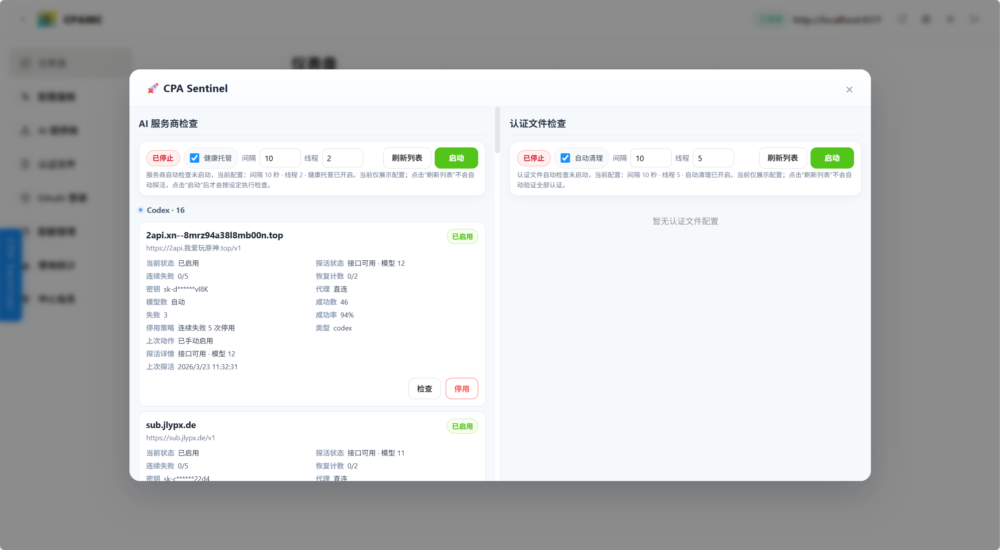

# CPA Sentinel

[](./LICENSE)

`CPA Sentinel` 是一个面向 `CLIProxyAPI / CPAMC` 管理后台的可视化巡检插件。

它会在管理页左侧注入一个悬浮入口，打开后提供统一的巡检与健康托管面板，覆盖两类核心场景：

- AI 服务商巡检与健康托管
- 认证文件巡检与自动清理

适合用于多服务商、多认证文件场景下的日常巡检、异常排查和状态管理。

## 软件截图

`README.md` 完全可以放软件截图，推荐把截图文件放到仓库内的 `docs/images/` 目录，再用 Markdown 图片语法引用。

当前展示：



## 功能概览

### AI 服务商巡检

- 展示 Gemini / Codex / Claude 等服务商配置
- 支持卡片级 `检查`
- 支持卡片级 `启用 / 停用`
- 支持自动巡检
- 支持健康托管
- 服务不可用时自动停用
- 服务恢复后自动启用
- 停用与启用逻辑基于 `excluded-models` / `excludedModels`

### 服务商健康策略

- 默认连续失败 `5` 次后自动停用
- 高成功率服务商可放宽到连续失败 `10` 次停用
- 已停用服务商连续成功 `2` 次后自动恢复启用
- 卡片内展示：
  - 当前状态
  - 探活状态
  - 探活详情
  - 连续失败计数
  - 恢复计数
  - 停用策略
  - 上次探活时间

### 认证文件巡检

- 展示认证文件分组、状态、更新时间等信息
- 支持卡片级 `验证使用`
- 支持卡片级 `清理删除`
- 支持自动巡检
- 支持自动清理无效认证
- 检查过程中显示 `检查中`

### 面板交互

- 操作区集中在面板顶部
- 启动自动巡检后锁定对应配置项，避免冲突操作
- `刷新列表` 只刷新数据，不再隐式触发检查
- 卡片操作统一收敛为 `检查 / 启用 / 停用`

## 工作原理

插件主要完成以下工作：

1. 拦截当前管理后台的同源请求，自动捕获 Bearer Token
2. 向页面动态注入悬浮按钮和巡检弹框
3. 通过 `/v0/management/*` 接口读取配置与执行检查
4. 对 AI 服务商执行真实探活，并按策略自动停用或恢复
5. 对认证文件执行验证，并按策略决定是否自动清理

## 相关文件

- `auto_check.js`
  插件主脚本，包含 UI、自动巡检、探活、启停、认证文件处理等逻辑
- `management.html`
  管理后台页面，插件最终以内联脚本形式注入到该页面
- `inline_inject.py`
  用于将 `auto_check.js` 内联注入到 `management.html`
- `readme.m`
  对外介绍版文档

## 安装方式

### 在当前项目中直接使用

```powershell
node --check .\auto_check.js
python .\inline_inject.py
```

执行完成后刷新 `management.html`。

### 发布给其他用户使用

建议至少包含以下文件：

- `auto_check.js`
- `management.html`
- `inline_inject.py`
- `README.md`
- `readme.m`

推荐流程：

1. 替换或合并 `auto_check.js`
2. 执行 `python .\inline_inject.py`
3. 刷新或重启管理后台页面

## 为什么推荐内联注入

当前环境下，`management.html` 无法稳定通过外链方式加载 `auto_check.js`，因此推荐以内联注入方式发布：

1. 修改 `auto_check.js`
2. 执行：

```powershell
node --check .\auto_check.js
python .\inline_inject.py
```

3. 刷新后台页面

这样可以避免以下问题：

- 插件按钮不显示
- 脚本未生效
- 外链资源路径失效

## 使用说明

### 打开面板

页面左侧会出现悬浮按钮：

- `CPA Sentinel`

点击后即可打开巡检面板。

### AI 服务商区域

可执行操作：

- `刷新列表`
  只刷新配置数据
- `启动`
  启动自动巡检
- `停止`
  停止自动巡检
- `检查`
  对当前服务商执行一次单独探活
- `启用`
  手动启用当前服务商
- `停用`
  手动停用当前服务商

### 认证文件区域

可执行操作：

- `刷新列表`
  只刷新认证文件列表
- `启动`
  启动自动巡检
- `停止`
  停止自动巡检
- `验证使用`
  验证当前认证文件是否可用
- `清理删除`
  删除当前认证文件

## 状态说明

### 服务商状态

- `已启用`
  当前服务商处于可用配置状态
- `已停用`
  当前服务商已被托管逻辑或手动操作停用
- `检查中`
  当前正在执行探活
- `未探活`
  尚未执行本轮检查
- `接口可用`
  最近一次探活成功
- `接口异常 / 探活异常 / 额度不足或请求受限 / 鉴权失败`
  最近一次探活失败

### 认证文件状态

- `检查中`
  当前正在验证
- `状态有效`
  当前认证可用
- `认证失效`
  认证 token 已失效或鉴权失败
- `验证失败`
  已执行验证，但结果失败
- `验证异常`
  验证过程发生异常

## 发布建议

适合发布标签：

- `CLIProxyAPI`
- `CPAMC`
- `AI Provider Monitor`
- `Auth File Check`
- `AI Asset Management`

推荐发布简介：

> CPA Sentinel 是一个用于 CLIProxyAPI / CPAMC 管理后台的可视化巡检插件，提供 AI 服务商探活、自动停用、自动恢复、认证文件校验、自动清理以及卡片级手动操作能力。

## 发布前建议

正式发布前建议完成以下冒烟检查：

1. 打开弹框，确认插件正常显示
2. AI 服务商卡片执行 `检查`
3. AI 服务商卡片执行 `启用 / 停用`
4. 启动后再停止自动巡检
5. 认证文件执行 `验证使用 / 清理删除`
6. 无 token 或登录过期时，界面是否能正常恢复

## 调试建议

修改插件后，建议固定执行：

```powershell
node --check .\auto_check.js
python .\inline_inject.py
```

如果需要排查问题，重点检查：

- 浏览器控制台日志
- `/v0/management/config`
- `/v0/management/auth-files`
- `/v0/management/api-call`
- `/v0/management/usage`

## 兼容性说明

插件依赖管理后台已经具备以下接口能力：

- `/v0/management/config`
- `/v0/management/auth-files`
- `/v0/management/api-call`
- `/v0/management/usage`
- 对应服务商管理接口

如果目标环境接口结构不同，可能需要按实际字段调整。

## License

如果计划对外开源发布，建议补充自己的 License，例如：

- MIT
- Apache-2.0
